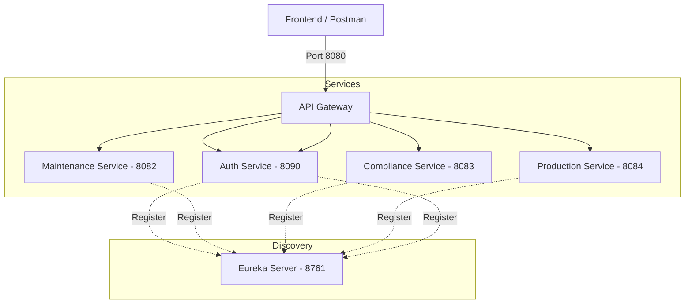

# 🏗 Microservices Architecture – Asset, Maintenance, Compliance & Production System

This repository implements a **real-world enterprise-grade microservices architecture** using **Spring Boot, Spring Cloud, Eureka, API Gateway, Feign Clients, and MySQL**.

The system models an **industrial operations platform** where Assets are the source of truth and multiple services interact in a loosely coupled, scalable manner.

---

## 🛠 Tech Stack

- Java 17  
- Spring Boot 3.2.x  
- Spring Cloud 2023.x  
- Spring Data JPA (Hibernate)  
- Spring Cloud Netflix Eureka  
- Spring Cloud Gateway  
- OpenFeign  
- MySQL  
- Lombok  

---

## 🧠 Architecture Overview

The system utilizes a **decentralized microservices pattern**. All external requests are routed through the **API Gateway**, while **Eureka** acts as the central brain for service discovery.




## 🔗 Service Responsibilities

### Assets Service (Source of Truth)
- Manages asset lifecycle
- All other services validate `assetId` via Feign
- Owns asset data

### Maintenance Service
- Manages maintenance work orders
- Validates assets via Assets Service
- Tracks maintenance status and progress

### Compliance Service
- Manages compliance reports
- Automatically generates audit logs
- Preserves audit history even after deletion

### Production Service
- Manages production plans and records
- Links production records to plans
- Enriches responses with asset details via Feign

### Dashboard Service (Planned)
- Aggregates read-only data from all services
- Single API for UI dashboards

---

## 🔄 Inter-Service Communication

- All services communicate using **Feign Clients**
- Eureka resolves service instances dynamically
- No hardcoded URLs

Example:
```java
@FeignClient(name = "ASSETS-SERVICE")
public interface AssetClient {
    @GetMapping("/api/assets/{id}")
    AssetDTO getAssetById(@PathVariable Long id);
}
```
## 🌐 Service Ports

The following ports are assigned to each service for local development and service discovery:

| Service              | Port |
|----------------------|------|
| Eureka Server        | 8761 |
| API Gateway          | 8080 |
| Assets Service       | 8081 |
| Maintenance Service  | 8082 |
| Compliance Service   | 8083 |
| Production Service   | 8084 |
| Auth Service         | 8090 |

---

## 🚪 API Gateway Routing

To ensure security and centralized management, all external traffic must go through the **API Gateway (Port 8080)**. The gateway handles request forwarding to the internal microservices using load-balanced (lb) logical names.

### Route Mapping:
* `/api/assets/**` ➡️ `lb://ASSETS-SERVICE`
* `/api/maintenance/**` ➡️ `lb://MAINTENANCE-SERVICE`
* `/api/compliance/**` ➡️ `lb://COMPLIANCE-SERVICE`
* `/api/production/**` ➡️ `lb://PRODUCTION-SERVICE`

## 📡 API Endpoints (Gateway Only)

All endpoints listed below should be accessed via the **API Gateway (Port 8080)**.

### 🧱 Assets Service
* `POST   /api/assets` — Create a new asset.
* `GET    /api/assets` — Retrieve all assets.
* `GET    /api/assets/{id}` — Get specific asset details.
* `PUT    /api/assets/{id}` — Update an existing asset.
* `DELETE /api/assets/{id}` — Delete an asset.
* `GET    /api/assets/exists/{id}` — Check asset existence for other services.

### 🛠 Maintenance Service
* `POST   /api/maintenance/work-orders` — Create a maintenance work order.
* `GET    /api/maintenance/work-orders` — List all work orders.
* `PATCH  /api/maintenance/work-orders/{id}/update-progress` — Update status of a specific order.

### 📋 Compliance Service
* `POST   /api/compliance/reports` — Submit a new compliance report.
* `GET    /api/compliance/reports` — Fetch all reports.
* `GET    /api/compliance/reports/{id}` — View specific report details.
* `PUT    /api/compliance/reports/{id}` — Edit a compliance report.
* `DELETE /api/compliance/reports/{id}` — Remove a report (triggers audit preservation).
* `GET    /api/compliance/audit-log` — View full history of changes/deletions.

### 🛢 Production Service
* `POST   /api/production/plans` — Create a production schedule.
* `GET    /api/production/plans` — List all production plans.
* `POST   /api/production/records` — Log daily production data.
* `GET    /api/production/records` — Fetch all production records.
* `GET    /api/production/records/plan/{planId}` — Filter records by plan.

### 🛢 Auth Service
* `GET   /auth/getmanagerdetails` — Get operational manager details.
* `GET    /api/getadmindetails` — Get admin/user details.
* `GET    /api/details?role={role}` — Get user with roles


## 🗂 Database Strategy

To ensure high availability and scalability, each microservice owns its own isolated database.

| Service | Database |
| :--- | :--- |
| Assets | `assets_db` |
| Maintenance | `maintenance_db` |
| Compliance | `compliance_db` |
| Production | `production_db` |

* ✔ **No shared databases**
* ✔ **Loose coupling**
* ✔ **Independent scaling**

---

## 🧪 Startup & Testing Order

Follow this specific sequence to ensure all services register correctly with the discovery server:

1.  **Start MySQL:** Ensure the database server is running.
2.  **Start Eureka Server:** Wait for the dashboard to be available at `http://localhost:8761`.
3.  **Start API Gateway:** The entry point for all traffic.
4.  **Start Microservices in order:**
    * Assets Service
    * Maintenance Service
    * Compliance Service
    * Production Service

**Verify Setup:**
Test the end-to-end routing through the gateway:
`GET http://localhost:8080/api/assets/1`

---

## 🚀 Future Enhancements

* **Dashboard Service:** Aggregating data for unified views.
* **Security:** Implementation of JWT for AuthN/AuthZ.
* **Resilience:** Adding Circuit Breakers via Resilience4j.
* **Observability:** Centralized logging (ELK Stack) and Distributed Tracing (Zipkin).

---

## 👨‍💻 Author

**Manohar Singh**
